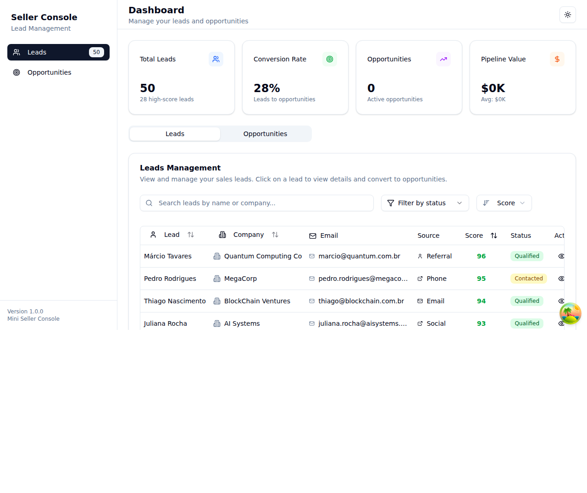
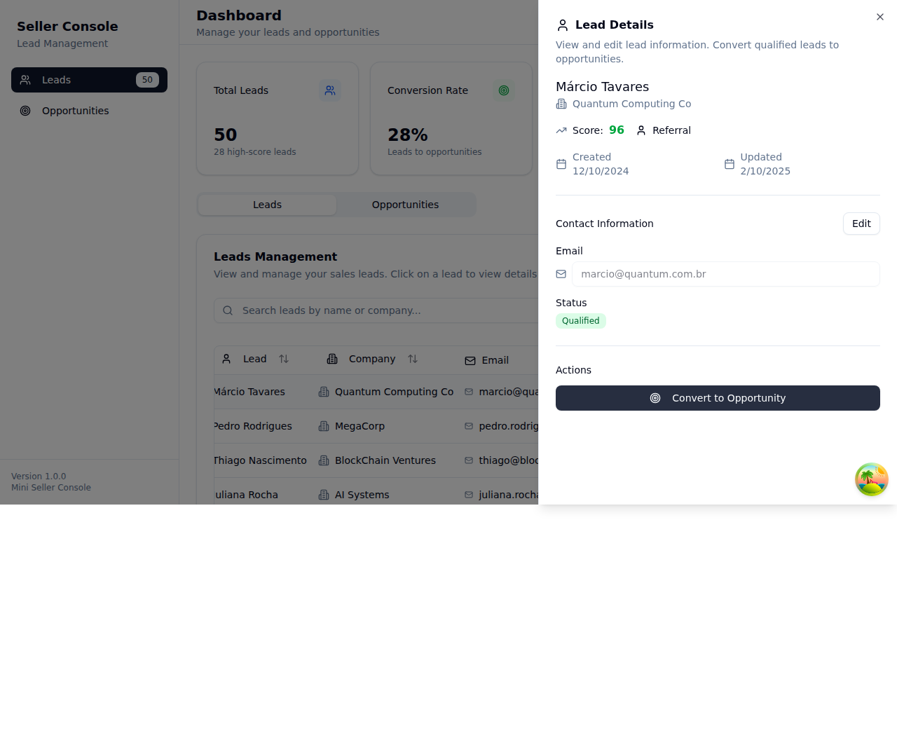
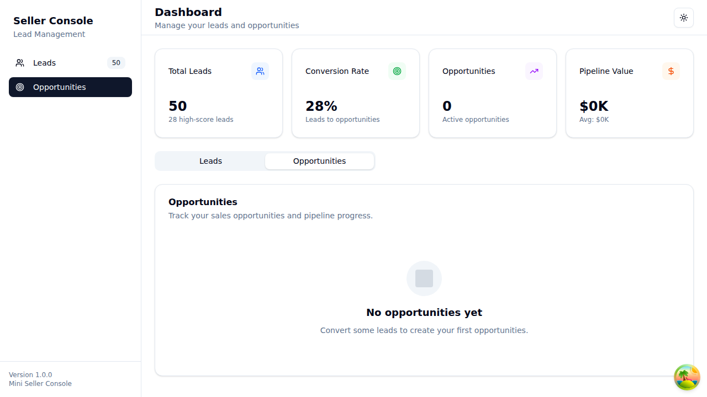

# 🎯 Seller Console - 5-Minute App Explanation

*A comprehensive overview of the modern CRM application for sales teams*

## 📋 What is Seller Console?

**Seller Console** is a lightweight yet powerful Customer Relationship Management (CRM) application designed specifically for sales teams to efficiently manage leads and convert them into opportunities. Think of it as your digital sales command center where every potential customer is tracked, scored, and nurtured through the sales pipeline.

### 🎯 Live Demo
**Try it yourself:** https://seller-console-fawn.vercel.app/

---

## 🏗️ What Problem Does It Solve?

Sales teams often struggle with:
- **Scattered lead information** across multiple tools
- **Manual lead scoring** and prioritization
- **Inefficient conversion** from leads to opportunities
- **Lack of visibility** into sales pipeline
- **Poor mobile experience** for field sales

**Seller Console solves these problems** by providing a unified, modern interface that works seamlessly across all devices.

---

## 🌟 Core Features & Capabilities

### 📊 **Dashboard Overview**
- **Real-time statistics**: Total leads (50), conversion rate (28%), pipeline value
- **High-score lead identification**: Automatically highlights leads with scores 70+
- **Quick navigation**: Instant switching between leads and opportunities

### 🔍 **Advanced Lead Management**
- **Smart search**: Find leads by name or company instantly
- **Intelligent filtering**: Filter by status (New, Contacted, Qualified, etc.)
- **Dynamic sorting**: Sort by score, name, company, or creation date
- **Lead scoring**: Automatic 0-100 scoring system for prioritization
- **Source tracking**: Website, referral, social media, email, phone

### 📱 **Professional Data Display**
- **Responsive tables**: Full-featured on desktop, mobile-optimized cards on small screens
- **Pagination**: Configurable items per page (5, 10, 20, 30, 50)
- **Status badges**: Color-coded lead statuses for quick identification
- **Contact information**: Email addresses with direct links

### ⚡ **Lead Detail Management**
- **Detailed side panel**: Complete lead information in an elegant slideout
- **In-place editing**: Update email and status without page refresh
- **Lead conversion**: Transform qualified leads into opportunities with one click
- **Activity tracking**: Creation and update timestamps

### 🚀 **Opportunity Pipeline**
- **Lead-to-opportunity conversion**: Seamless workflow for qualified leads
- **Stage management**: Track opportunities through sales stages
  - Prospecting → Qualification → Proposal → Negotiation → Closed Won/Lost
- **Amount tracking**: Expected deal values and pipeline calculations
- **Account association**: Link opportunities to company accounts

### 💾 **Data Persistence & Management**
- **Automatic saving**: All changes persist across browser sessions
- **Local storage**: Data survives page refreshes and browser restarts
- **Export/Import**: Backup and restore data in JSON format
- **Multi-layer storage**: Redundant data protection

---

## 🛠️ Technology Stack (Modern & Professional)

### 🎨 **Frontend Excellence**
- **⚛️ React 19**: Latest version with concurrent features
- **📘 TypeScript 5.8**: Full type safety and developer experience
- **⚡ Vite 7**: Lightning-fast development and builds
- **🎨 Tailwind CSS 4**: Utility-first styling for consistency

### 🧩 **Premium UI Components**
- **🎭 Shadcn UI**: High-quality, accessible component library
- **🎨 Radix UI**: Unstyled, accessible primitives
- **🎯 Lucide React**: Beautiful, consistent icon system

### 📊 **State Management**
- **🐻 Zustand**: Lightweight, performant state management
- **🔄 TanStack Query**: Server state caching and synchronization
- **💾 Persistent storage**: localStorage with automatic sync

### 🔐 **Forms & Validation**
- **📝 React Hook Form**: Performant forms with minimal re-renders
- **✅ Zod**: TypeScript-first schema validation
- **🛡️ Error handling**: Graceful error boundaries and recovery

### 🧪 **Quality Assurance**
- **🔍 Vitest**: Modern, fast test runner
- **🧪 React Testing Library**: Component testing utilities
- **📏 ESLint + Prettier**: Code quality and formatting
- **📊 52 tests across 11 files**: Comprehensive test coverage

---

## 👤 User Workflow Example

### **Scenario**: Converting a qualified lead to an opportunity

1. **📊 Dashboard Overview**: Sales rep sees 50 total leads, 28 are high-score
2. **🔍 Filter & Search**: Filters for "Qualified" status leads
3. **📱 Browse Leads**: Reviews lead table, sorted by score (highest first)
4. **👆 Lead Details**: Clicks "View details" on Márcio Tavares (Score: 96)
5. **📝 Review Information**: 
   - Company: Quantum Computing Co
   - Email: marcio@quantum.com.br
   - Source: Referral
   - Status: Qualified
6. **🚀 Convert**: Clicks "Convert to Opportunity"
7. **📋 Fill Form**: 
   - Opportunity Name: "Quantum Computing Co - Márcio Tavares Opportunity"
   - Stage: Prospecting
   - Expected Amount: $50,000
   - Account: Quantum Computing Co
8. **✅ Save**: Opportunity is created and appears in pipeline
9. **📊 Updated Dashboard**: Conversion rate increases, pipeline value updates

---

## 🎯 Key Benefits & Value Proposition

### **For Sales Representatives**
- ⏱️ **Time Savings**: No more switching between multiple tools
- 🎯 **Better Prioritization**: Lead scoring helps focus on best prospects
- 📱 **Mobile Ready**: Works perfectly on phones and tablets
- 💼 **Professional Interface**: Modern UI that impresses clients

### **For Sales Managers** 
- 📊 **Real-time Visibility**: Dashboard shows team performance instantly
- 📈 **Pipeline Tracking**: Monitor conversion rates and deal values
- 📋 **Data-Driven Decisions**: Lead scoring and filtering for strategy
- 🔄 **Process Standardization**: Consistent lead-to-opportunity workflow

### **For IT Teams**
- 🛡️ **Type Safety**: TypeScript prevents runtime errors
- 🧪 **Well Tested**: 52 tests ensure reliability
- 📦 **Modern Stack**: Easy to maintain and extend
- 🚀 **Fast Performance**: Optimized for speed and responsiveness

---

## 📸 Screenshots

### Dashboard with Leads

*Main dashboard showing lead management interface with sorting, filtering, and pagination*

### Lead Detail Panel

*Detailed lead information panel with editing capabilities and conversion options*

### Opportunities Tab

*Opportunities management interface (empty state shown)*

---

## 🌟 Why Seller Console Stands Out

1. **🎨 Modern UX/UI**: Clean, intuitive design that users actually enjoy
2. **📱 True Responsiveness**: Works seamlessly on any device size
3. **⚡ Performance**: Fast loading, smooth interactions, no lag
4. **🔧 Developer Experience**: Well-architected, maintainable codebase
5. **🧪 Production Ready**: Comprehensive testing and error handling
6. **💾 Reliable**: Multiple layers of data persistence
7. **🎯 Focused**: Does one thing very well - lead management

---

## 🚀 Getting Started

```bash
# Clone and run locally
git clone https://github.com/gmartins-dev/seller-console
cd seller-console
npm install
npm run dev
```

**Or try the live demo**: https://seller-console-fawn.vercel.app/

---

## 📊 Quick Stats

- **📝 Lines of Code**: ~3,000+ lines of TypeScript/React
- **🧪 Test Coverage**: 52 tests across 11 test files
- **📦 Bundle Size**: ~530KB (optimized for production)
- **⚡ Build Time**: ~3.5 seconds
- **📱 Responsive**: Works on screens from 320px to 4K

---

**Seller Console** represents the future of sales tools - modern, efficient, and built with the latest technologies. It's not just a CRM; it's a sales acceleration platform that helps teams convert more leads into opportunities with less effort.

*Ready to transform your sales process? Try it today!* 🚀